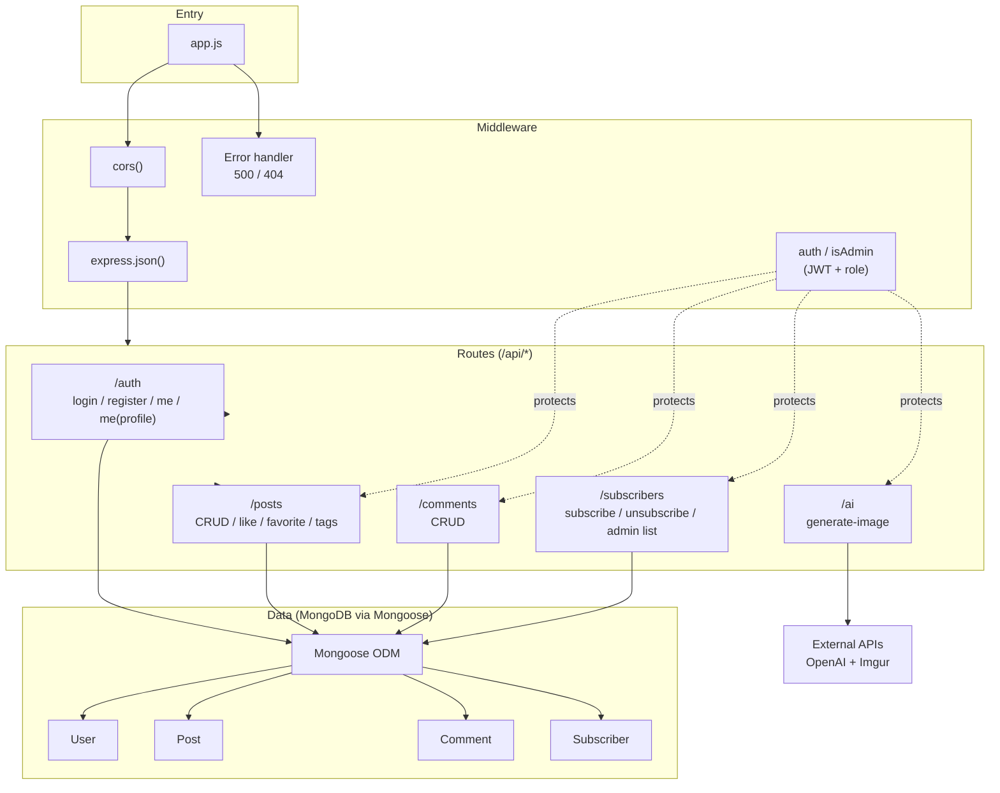
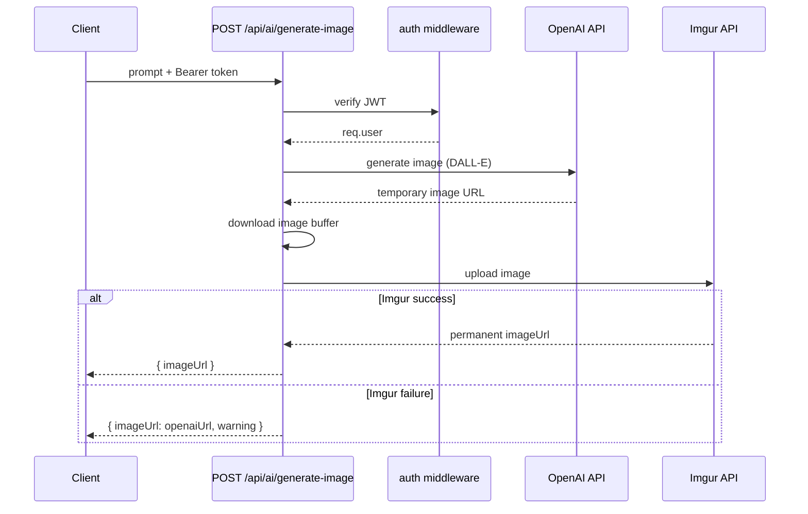

# Backend Architecture

Structure of the Node.js / Express API under `backend/`.

## Layered architecture

## Application entry (`app.js`)

1. Load environment variables (`dotenv`).
2. Connect to MongoDB (`MONGODB_URI`).
3. Run `scripts/initData.js` on startup (seed users, posts, sample comments).
4. Register middleware: `cors()`, `express.json()`.
5. Mount route modules under `/api/*`.
6. Global error handler (500) and 404 handler.

## API routes

| Prefix | File | Main endpoints |
|--------|------|----------------|
| `/api/auth` | `routes/auth.js` | `POST /login`, `POST /register`, `GET /me`, `PUT /me/profile` |
| `/api/posts` | `routes/posts.js` | CRUD, `POST /:id/like`, `POST /:id/favorite`, `GET /me/myposts`, `GET /tag/:tagName`, `GET /tags/unique` |
| `/api/comments` | `routes/comments.js` | `GET /post/:postId`, `POST /`, `PUT /:id`, `DELETE /:id` |
| `/api/subscribers` | `routes/subscribers.js` | `POST /` (subscribe), `PUT /unsubscribe/:id`, admin `GET /`, `PUT /:id` |
| `/api/ai` | `routes/aiImageRoutes.js` | `POST /generate-image` (auth required) |

## Middleware (`middleware/auth.js`)

| Middleware | Purpose |
|------------|---------|
| `auth` | Read `Authorization: Bearer <token>`, verify JWT, set `req.user` |
| `isAdmin` | Require `req.user.role === 'admin'` |

Protected routes use `auth`; ownership checks (e.g. only author or admin can edit a post) are implemented inside route handlers.

## Data models

| Model | File | Notes |
|-------|------|-------|
| **User** | `models/User.js` | bcrypt password hashing on save; `role`, `favorites[]` |
| **Post** | `models/Post.js` | `author` ref, `tags[]`, `likes[]`, `imageUrl` |
| **Comment** | `models/Comment.js` | `postId`, `user`, `content`, `isPublic` |
| **Subscriber** | `models/Subscriber.js` | `email`, `status` (active / unsubscribed) |

## AI image pipeline (`routes/aiImageRoutes.js`)

## Environment variables

| Variable | Purpose |
|----------|---------|
| `MONGODB_URI` | MongoDB connection string |
| `PORT` | Server port (default 5000) |
| `JWT_SECRET` | Sign and verify JWT |
| `OPENAI_API_KEY` | DALL-E image generation |
| `IMGUR_CLIENT_ID` | Upload generated images |

See `backend/env.example` for a template.

## Initialization script

`scripts/initData.js` — creates default admin/user accounts, sample posts, and random comments. Invoked from `app.js` after MongoDB connects. Can also be run standalone via `npm run init-data`.

## Related pages

- [System Overview](System-Overview)
- [Frontend Architecture](Frontend-Architecture)

