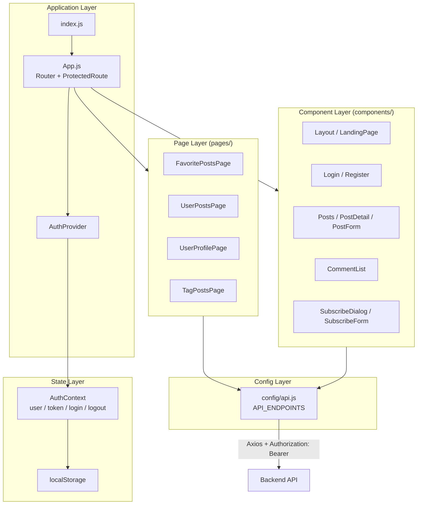

# Frontend Architecture

Structure of the React single-page application (SPA) under `frontend/`.

## Layered architecture



## Directory roles

| Path | Role |
|------|------|
| `src/App.js` | Root router, `ProtectedRoute`, route definitions |
| `src/context/AuthContext.js` | Global auth state, login/register/logout, token restore via `/api/auth/me` |
| `src/config/api.js` | Base URL (`REACT_APP_API_URL`) and endpoint constants |
| `src/pages/` | Route-level screens (favorites, my posts, profile, tag browse) |
| `src/components/` | Reusable UI (posts, comments, login, layout, post form) |
| `src/theme.js` | Material UI theme |

## Routing

| Route | Access | Page / component |
|-------|--------|------------------|
| `/` | Public | LandingPage |
| `/login`, `/register` | Public | Login, Register |
| `/posts`, `/posts/:id` | Protected | Posts, PostDetail |
| `/favorites` | Protected | FavoritePostsPage |
| `/my-posts` | Protected | UserPostsPage |
| `/profile` | Protected | UserProfilePage |
| `/tags/:tagName` | Public | TagPostsPage |

`ProtectedRoute` checks `AuthContext.user`; unauthenticated users are redirected to `/login`.

## Authentication flow

1. **Login:** `POST /api/auth/login` → store JWT in `localStorage` → update `AuthContext` (`user`, `token`).
2. **App load:** If token exists → `GET /api/auth/me` with `Authorization: Bearer <token>` → restore user or clear invalid token.
3. **API calls:** Protected actions attach `Authorization: Bearer <token>` in Axios headers.

## Key feature touchpoints

| Feature | Main files |
|---------|------------|
| Post CRUD | `PostForm.js`, `UserPostsPage.js`, `Posts.js` |
| Tags | `PostForm.js`, `TagPostsPage.js`, `RecommendedTopics.js` |
| Comments | `CommentList.js` on `PostDetail` |
| AI cover image | `PostForm.js` → `API_ENDPOINTS.AI.GENERATE_IMAGE` |
| Favorites | `FavoritePostsPage.js`, like/favorite calls in post components |

## Environment

```env
REACT_APP_API_URL=http://localhost:5000/api
```

Production builds point this to the deployed backend API URL.

## Related pages

- [System Overview](System-Overview)
- [Backend Architecture](Backend-Architecture)

