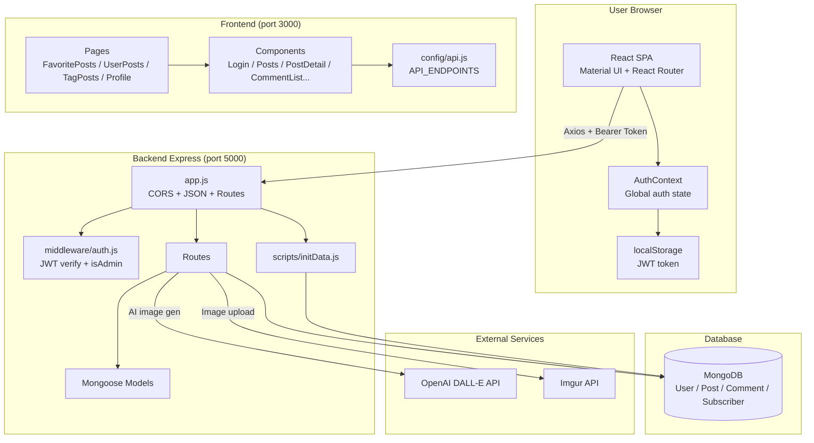

# System Overview

High-level view of how the browser, frontend, backend, database, and external services connect in **Wordwalker**.

## Architecture diagram



## Layers

| Layer | Technology | Responsibility |
|-------|------------|----------------|
| **Client** | React SPA + AuthContext + localStorage | UI, routing, JWT persistence in the browser |
| **Frontend** | React, MUI, Axios, `config/api.js` | Pages and components; calls backend with `Authorization: Bearer <token>` |
| **Backend** | Express, Mongoose, JWT middleware | REST API, authorization, business logic, API secrets |
| **Database** | MongoDB | Users, posts, comments, subscribers |
| **External** | OpenAI + Imgur | AI cover images; stable public image URLs on posts |

## Request flow examples

### Login

```
Browser → POST /api/auth/login → verify password (bcrypt) → JWT → localStorage + AuthContext
```

### Read a post

```
Browser → GET /api/posts/:id → Express → Mongoose → MongoDB → JSON → React (PostDetail)
```

### Create post with AI image (authenticated)

```
Browser (JWT) → POST /api/ai/generate-image → OpenAI → download → Imgur → imageUrl
Browser (JWT) → POST /api/posts { title, content, imageUrl } → save to MongoDB
```

## Security note

The browser **never** talks to MongoDB or external APIs (OpenAI, Imgur) directly. Only the Express server does, keeping credentials on the server.

## Related pages

- [Frontend Architecture](Frontend-Architecture)
- [Backend Architecture](Backend-Architecture)

